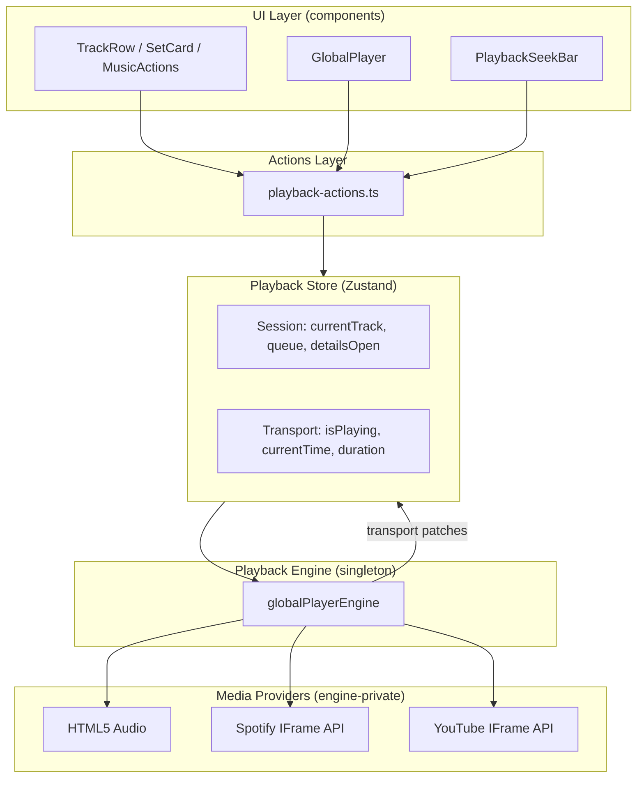

# Playback Architecture

> **LOCKED:** Three-domain separation — AUDIO | VIDEO | SETS. See [`audio-video-sets-architecture-lock.md`](./audio-video-sets-architecture-lock.md).
> **FROZEN:** Sets / Video watch experience rules are immutable. See [`sets-video-architecture-freeze.md`](./sets-video-architecture-freeze.md) before any playback change. Do not modify Sets files for audio-only work.

Vitalforge playback is **UI-agnostic** at the engine layer. Audio and Video are **separate UI experiences** sharing one engine.

## Layer Diagram



## Strict Layers

| Layer | Location | Responsibility |
|-------|----------|----------------|
| **UI** | `src/components/**` | Render store state; dispatch actions only |
| **Actions** | `src/lib/music/playback-actions.ts` | User-intent policy (click, expand, seek) |
| **Store** | `src/stores/playback-store.ts` | Single source of truth; queue; UI flags |
| **Engine** | `src/lib/music/global-player-engine.ts` | Media lifecycle; provider routing |
| **Providers** | `spotify-embed-api`, `youtube-embed-api` (engine-private), audio DOM | Play/pause/seek/destroy |

**Import rule:** UI → actions → store → engine → providers. Never skip layers.

## State Ownership

### Store owns (session + UI)

- `currentTrack` — set on `play()`, cleared on `stop()` / engine idle
- `queue`, `queueIndex` — built on each `play()`
- `detailsOpen` — floating player visibility (close ≠ stop)
- `hydrated` — persistence restore complete

### Engine owns (transport)

Written **only** via `applyTransportFromEngine()` listener:

- `isPlaying`, `isLoading`
- `currentTime`, `duration`
- `error`

Store actions **must not** optimistically set transport fields, with these pragmatic exceptions:

- `play()` / `pause()` / `resume()` set `isLoading` / `isPlaying` for immediate UI feedback; engine listener is authoritative
- `seek()` applies optimistic `currentTime` for scrubber responsiveness

## Component Responsibilities

| Component | Reads | Dispatches |
|-----------|-------|------------|
| `PlaybackRoot` | — | `initializePlaybackEngine()` once |
| `GlobalPlayer` | store selectors | `togglePlayback`, `closePlayerSurface` |
| `PlaybackSeekBar` | `currentTime`, `duration` | `seekTo` |
| `useCardPlayback` | `isActive`, `isPlaying` | `handlePlaybackSurfaceClick` |
| `MusicActions` | `isActive`, `isPlaying` | `handlePlaybackSurfaceClick` |
| `SetDetail` | — | `expandPlaybackSurface` |

`usePlayback()` in `PlaybackContext` is **deprecated** — use store selectors + actions.

## Lifecycle

```
1. app/layout.tsx mounts <PlaybackRoot /> (once, never destroys engine)
2. initializePlaybackEngine()
   → globalPlayerEngine.mount() → #vitalforge-playback-root on document.body
   → bindEngineListener()
   → restore persisted session if present
3. User click → playback-actions → store.play() → engine.play()
4. Engine emits transport patches → store → UI re-renders
5. Route change → UI unmounts/remounts → engine + store persist
6. closePlayerSurface() → detailsOpen=false, playback continues
```

### Singleton guarantees

- Engine mounts once; `mount()` is idempotent
- `PlaybackRoot` cleanup **does not** destroy engine or media
- Embed host: browser-audible (`opacity:1`, `visibility:visible`), `pointer-events:none`, fixed at `bottom:0` — not part of the UI player shell

## Provider Behavior

| Provider | When | Play path | Seek API |
|----------|------|-----------|----------|
| HTML5 Audio | `previewUrl` resolved | `audio.play()` | `audio.currentTime` |
| Spotify | Spotify URL / track ID | IFrame API `loadUri` + `play()` (preloaded on mount) | `controller.seek(ms)` |
| YouTube | Set / YouTube URL | Sync `iframe.src` with autoplay (user-gesture chain) | iframe reload with `start=` seek param |

\*YouTube seek reloads the embed at the target `start` second while keeping sync iframe play for initial autoplay.

Source resolution (`playback-source.ts`, `track-source.ts`) runs in the engine path only.

## Debugging

### Console probes

```js
// In browser console (dev builds)
__playbackDebug.dump()
```

### DOM checks

- Engine root: `#vitalforge-playback-root` (exactly one)
- UI player: `[aria-label="Now playing"]` when `detailsOpen`
- Singleton iframes: engine asserts ≤1 iframe in root

### npm scripts

```bash
npm run test:playback        # Contract tests (store + engine invariants)
npm run audit:playback-arch  # UI boundary violations
npm run stress:playback      # Engine race/generation stress
npm run validate:playback    # Playwright E2E (requires dev server)
```

## Architecture Rules (enforced)

1. UI **cannot** import `global-player-engine`, `spotify-embed-api`, or `youtube-embed-api`
2. UI **cannot** create/destroy `<audio>` or playback `<iframe>` elements
3. UI **cannot** maintain local playback state (no `useState` for isPlaying/position)
4. Only the engine may create, destroy, pause, resume, seek, and switch media
5. All click policy lives in `playback-actions.ts` — not duplicated in components

Run `npm run audit:playback-arch` in CI to enforce rules 1–2.

## Playback Reliability Protocol (Part 1)

Playback is **frozen production infrastructure**. The architecture shape must not change.

```
UI → playback-actions → playback-store → global-player-engine → providers
```

### Protected files (no rewrite without reproducible bug + tests)

- `src/lib/music/global-player-engine.ts`
- `src/lib/music/spotify-embed-api.ts`
- `src/lib/music/player.ts`
- `src/lib/music/playback-actions.ts`
- `src/stores/playback-store.ts`
- `src/components/music/PlaybackRoot.tsx`
- `src/lib/music/providers/**`

### Never

- Second engine, duplicate players, Zustand/PlaybackRoot replacement
- Provider rewrites, playback state in UI, UI-created audio/iframes
- Direct provider imports from components

### UI must

| Read | Dispatch |
|------|----------|
| `usePlaybackStore()` selectors | `playback-actions` functions |

Cursor rule: `.cursor/rules/playback-reliability-protocol.mdc`

## Playback Reliability Protocol (Part 2)

### Bug-fix workflow

1. Reproduce → 2. Identify layer → 3. Fix **only** that layer → 4. Manual verify → 5. `npm run verify:playback`

Never blindly refactor. Never rewrite working code.

### Manual checklist (after any playback change)

**Tracks:** play, pause, resume, seek, duration, progress  
**Sets:** play, video renders, audio audible  
**Switching:** Track↔Track, Set↔Set, Track↔Set — previous media stops; only latest plays  
**Singletons:** 1 audio, 1 iframe, 1 active provider — no stale embeds or background playback

### Deployment gate

```bash
npm run verify:playback   # audit:playback-arch + test:playback
```

**Deployment blocked if either fails.**

Cursor rule: `.cursor/rules/playback-reliability-protocol-part2.mdc`

## Playback Reliability Protocol (Part 3)

- **Seek:** real position change required — not visual-only (P0)
- **Navigation:** playback survives route changes; `PlaybackRoot` never remounts
- **Fast Refresh:** no duplicate players/listeners/iframes/audio
- **UI breaks playback → revert UI**, never redesign backend
- **Production bar:** 0 errors, 0 stale playback, 0 regressions

Cursor rule: `.cursor/rules/playback-reliability-protocol-part3.mdc`

## Deployment gate

```bash
npm run verify:playback
```

Runs architecture audit, full catalog stability audit, and all playback contract/regression tests (36).

### Catalog audit (offline)

```bash
npm run audit:playback-full
```

Writes `reports/playback-stability-audit.md` + `.json` with working/broken tracks and sets.

### Live embed probe (pre-release)

```bash
npm run audit:playback-full -- --live --apply-blocklist
```

oEmbed-validates playable IDs and updates `data/playback-blocklist.json`.

## Production safeguards

- `PlayerErrorBoundary` around `GlobalPlayer` — UI crashes do not take down the app
- Transport errors surface in player with **Retry playback**
- YouTube embeds retry once on load failure (engine)
- Duplicate `playItem` requests debounced (300ms); store ignores in-flight reloads

## UI refinement phase

Stabilization is complete. **UI improvements are expected** before launch.

| Layer | Change policy |
|-------|----------------|
| Components, layouts, styles | Free to redesign |
| `playback-actions.ts` | New user intents only |
| Protected backend (see below) | Bug fixes with repro only |

### Protected files

Do not modify unless a reproducible playback bug exists:

- `src/lib/music/global-player-engine.ts`
- `src/lib/music/spotify-embed-api.ts`
- `src/lib/music/player.ts`
- `src/stores/playback-store.ts`
- `src/components/music/PlaybackRoot.tsx`
- `src/lib/music/providers/**`

`GlobalPlayer.tsx`, cards, modals, and navigation are **not** protected — restyle freely using store + actions.

## Future UI Work

After this stabilization phase, you may freely change:

- Player layout / position / styling
- Card layouts
- Modal vs floating panel
- Navbar / homepage structure

**Without modifying:** engine, store transport logic, providers, or actions policy (unless adding new user intents).

If playback breaks after a pure UI change, the change violated layer boundaries — fix the UI import, not the engine.
